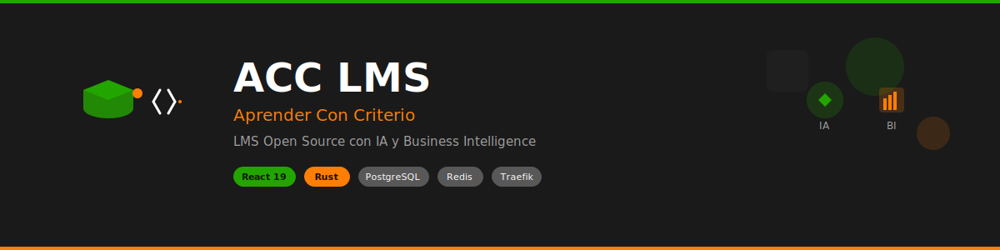

# 🎓 ACC LMS — Aprender Con Criterio

<p align="center">
  
</p>

**LMS Open Source con IA y Business Intelligence**

[](https://opensource.org/licenses/MIT)
[](https://github.com/ergrato-dev/acc-lms/graphs/contributors)
[](http://makeapullrequest.com)

---

## 🎯 Visión

LMS moderno con IA integrada y Business Intelligence para crear experiencias de aprendizaje personalizadas y datos accionables para instructores y dueños de plataforma.

## 🏗️ Arquitectura

- **Frontend:** React 19 + Vite + Tailwind CSS + TypeScript
- **Backend:** REST API con Rust (Actix-web / Axum) + Clean Architecture
- **IA y BI:** Servicios de primer nivel para personalización y analytics
- **HATEOAS:** APIs hipermedia para navegación dinámica y descubrimiento
- **Traefik:** API Gateway con service discovery y load balancing automático
- **Infraestructura:** Docker + Kubernetes + PostgreSQL + Redis + observabilidad completa

## 📋 Estado del Proyecto

✅ **Documentación completa** en `/_docs/` (estructura categorizada)

- **Architecture:** Diseño técnico, base de datos, infraestructura
- **Business:** Requisitos funcionales/no funcionales, user stories
- **Development:** Estándares de desarrollo y herramientas
- **Operations:** Métricas, monorepo strategy, separación
- **Security:** Políticas de ciberseguridad (LOCAL ONLY)

🚧 **Próximos pasos:**

- Implementación de servicios backend en Rust
- Setup de infraestructura con Traefik
- APIs HATEOAS para descubrimiento dinámico
- Frontend React 19 con componentes base

## 🔧 Guía rápida

### Documentación

```bash
# Revisar documentación por categorías
ls _docs/                     # Ver todas las categorías

# Architecture
cat _docs/architecture/database-architecture.md
cat _docs/architecture/infrastructure-traefik.md

# Business Requirements
cat _docs/business/functional-requirements.md
cat _docs/business/non-functional-requirements.md

# Development
cat _docs/development/development-standards.md
```

### Convenciones

- **Nomenclatura técnica:** Inglés únicamente
- **Documentación:** Español
- **Arquitectura:** Clean Architecture
- **APIs:** REST `/api/v1/` con JSON camelCase
- **BD:** PostgreSQL snake_case

## 📁 Estructura

```text
├── _docs/                    # Documentación categorizada
│   ├── architecture/         # Diseño técnico, DB, infraestructura
│   ├── business/             # Requisitos, user stories
│   ├── development/          # Estándares de desarrollo
│   ├── operations/           # Métricas, monorepo strategy
│   └── security/             # Ciberseguridad (LOCAL ONLY)
├── fe/                       # React 19 app (Frontend)
├── be/                       # Backend Rust REST API
├── db/                       # Migraciones y schemas
├── infra/                    # Docker, Traefik, K8s
└── scripts/                  # Scripts dev/prod
```

## 🤖 IA y BI como primer nivel

- **ai-service:** RAG, chatbot, recomendaciones, embeddings semánticos
- **business-intelligence-service:** Dashboards ejecutivos, cohortes, forecasting

## 🎯 MVP (8-10 semanas)

1. Autenticación y gestión de usuarios
2. Catálogo de cursos y matriculación
3. Contenido multimedia y progreso
4. Evaluaciones y calificaciones
5. Pagos integrados (Stripe/MercadoPago)
6. Panel de instructor y estudiante
7. IA para recomendaciones básicas
8. BI para métricas de negocio

## 🛡️ Seguridad

ACC LMS implementa **seguridad multicapa** para deployment en producción:

- 🔐 **Autenticación JWT** con rotación automática
- 🛡️ **Rate limiting** y protección DDoS
- 🔒 **SSL/TLS obligatorio** con Let's Encrypt
- 🚨 **Monitoreo 24/7** con Fail2Ban
- 📋 **Políticas completas** en [SECURITY.md](SECURITY.md)

Para reportar vulnerabilidades: [security@acc-lms.com](mailto:security@acc-lms.com)

## 📚 Documentación Técnica

Ver [`_docs/README.md`](_docs/README.md) para navegación completa por categorías:

- 🏗️ **Architecture:** [`database-architecture.md`](_docs/architecture/database-architecture.md), [`infrastructure-traefik.md`](_docs/architecture/infrastructure-traefik.md)
- � **Business:** [`functional-requirements.md`](_docs/business/functional-requirements.md), [`user-stories.md`](_docs/business/user-stories.md)
- � **Development:** [`development-standards.md`](_docs/development/development-standards.md)
- ⚙️ **Operations:** [`monorepo-separation-scorecard.md`](_docs/operations/monorepo-separation-scorecard.md)

> 🔐 **Nota:** Documentación de seguridad no se sincroniza con GitHub (solo local)

## 🤝 Contribuir

¡Las contribuciones son bienvenidas! Lee nuestra [Guía de Contribución](CONTRIBUTING.md) para empezar.

**Estándares obligatorios:**

- ✅ **PNPM** para gestión de dependencias frontend (no NPM/Yarn)
- ✅ **Cargo** para gestión de dependencias Rust
- ✅ **Clean Architecture** en backend
- ✅ **Tests** con cobertura >80%
- ✅ **Seguridad** verificada antes de merge

---

**Consultar `.github/copilot-instructions.md` para convenciones técnicas detalladas**
