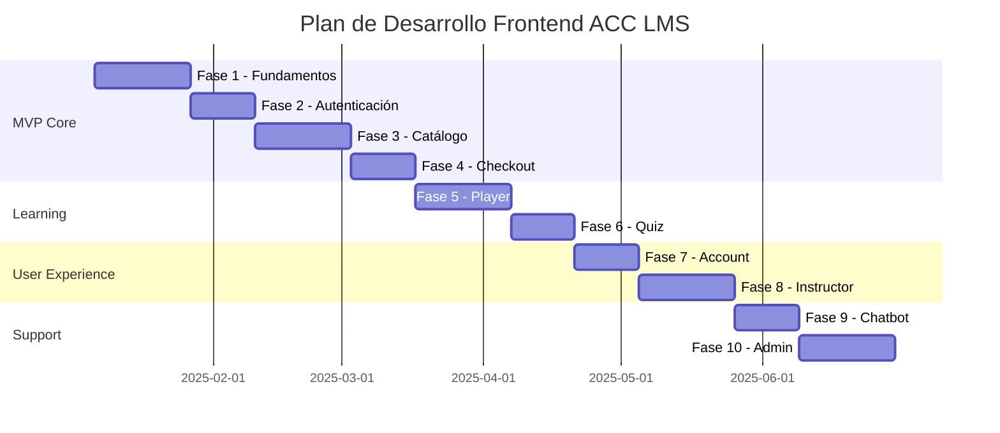

# 📋 Plan de Desarrollo Frontend - ACC LMS

**Versión:** 2025-12-22
**Estado:** Planificación inicial
**Derivado de:** functional-requirements.md, non-functional-requirements.md, user-stories.md

---

## 📊 Resumen del Stack y Requisitos

| Aspecto | Especificación |
|---------|----------------|
| **Framework** | React 19 + Vite 6.x + TypeScript |
| **Estilos** | Tailwind CSS 4.x |
| **Package Manager** | PNPM 9+ (obligatorio) |
| **i18n** | react-i18next (ES, EN, PT) |
| **Estado** | React Context + Custom Hooks |
| **Rendimiento** | <200ms P95, bundle <500KB gzipped |
| **Accesibilidad** | WCAG 2.1 AA |
| **Node.js** | 22.x LTS |

---

## 🏗️ Arquitectura de Carpetas

```
fe/src/
├── components/
│   ├── ui/                  # Componentes base reutilizables
│   │   ├── Button/
│   │   ├── Input/
│   │   ├── Modal/
│   │   ├── Card/
│   │   ├── Select/
│   │   ├── Spinner/
│   │   ├── Toast/
│   │   └── ...
│   ├── layout/              # Layout components
│   │   ├── Header/
│   │   ├── Footer/
│   │   ├── Sidebar/
│   │   └── MainLayout/
│   └── features/            # Componentes de dominio
│       ├── auth/
│       ├── courses/
│       ├── player/
│       ├── checkout/
│       ├── instructor/
│       └── chatbot/
├── pages/                   # Páginas/rutas
│   ├── Home/
│   ├── Courses/
│   ├── CourseDetail/
│   ├── Learn/
│   ├── Checkout/
│   ├── Account/
│   ├── Instructor/
│   ├── Auth/
│   ├── Contact/
│   └── Support/
├── hooks/                   # Custom hooks
│   ├── useAuth.ts
│   ├── useCourses.ts
│   ├── usePlayer.ts
│   ├── useCart.ts
│   └── useI18n.ts
├── context/                 # React Context
│   ├── AuthContext.tsx
│   ├── CartContext.tsx
│   ├── ThemeContext.tsx
│   └── I18nContext.tsx
├── services/                # API clients
│   ├── api.ts               # Axios instance base
│   ├── authService.ts
│   ├── coursesService.ts
│   ├── enrollmentsService.ts
│   ├── paymentsService.ts
│   ├── searchService.ts
│   ├── reviewsService.ts
│   └── ...
├── utils/                   # Utilidades
│   ├── validators.ts
│   ├── formatters.ts
│   ├── storage.ts
│   └── constants.ts
├── types/                   # TypeScript types
│   ├── api.types.ts
│   ├── entities.types.ts
│   └── ui.types.ts
├── locales/                 # Traducciones i18n
│   ├── es/
│   │   ├── common.json
│   │   ├── auth.json
│   │   ├── courses.json
│   │   ├── checkout.json
│   │   └── errors.json
│   ├── en/
│   │   └── ...
│   └── pt/
│       └── ...
└── styles/                  # Estilos globales
    └── globals.css
```

---

## 📅 Fases de Desarrollo

### **Fase 1: Fundamentos**
**Sprint 1-2 | Duración: 2-3 semanas | 34 SP**

| # | Tarea | Prioridad | SP | US/RF | Estado |
|---|-------|-----------|-----|-------|--------|
| 1.1 | Setup inicial: Vite + React 19 + TS + Tailwind | 🔥 Critical | 3 | — | ⬜ |
| 1.2 | Configuración PNPM + ESLint + Prettier | 🔥 Critical | 2 | RNF-005 | ⬜ |
| 1.3 | Sistema de diseño base (tokens, colores, tipografía) | 🔥 Critical | 5 | RNF-014 | ⬜ |
| 1.4 | Componentes UI base: Button, Input, Card, Modal | 🔥 Critical | 8 | — | ⬜ |
| 1.5 | Layout principal: Header, Footer, MainLayout | 🔥 Critical | 5 | — | ⬜ |
| 1.6 | Setup react-i18next + estructura locales | 🔥 Critical | 5 | RNF-015 | ⬜ |
| 1.7 | API client (Axios) + interceptors auth | 🔥 Critical | 3 | — | ⬜ |
| 1.8 | React Router + rutas base | 🔥 Critical | 3 | — | ⬜ |

**Entregables:**
- [ ] Proyecto inicializado con todas las configuraciones
- [ ] Sistema de diseño documentado
- [ ] Componentes UI base funcionando
- [ ] Layout responsivo implementado
- [ ] i18n funcionando con ES/EN
- [ ] API client configurado

---

### **Fase 2: Autenticación**
**Sprint 3 | Duración: 1-2 semanas | 27 SP**

| # | Tarea | Prioridad | SP | US/RF | Estado |
|---|-------|-----------|-----|-------|--------|
| 2.1 | AuthContext + token management | 🔥 Critical | 5 | RF-AUTH | ⬜ |
| 2.2 | Página de Registro (`/register`) | 🔥 Critical | 5 | US-001, RF-AUTH-001 | ⬜ |
| 2.3 | Página de Login (`/login`) | 🔥 Critical | 3 | US-002, RF-AUTH-002 | ⬜ |
| 2.4 | Flujo "Recordarme" + refresh tokens | ⚡ High | 3 | US-002 | ⬜ |
| 2.5 | Página "Olvidé contraseña" | ⚡ High | 3 | RF-AUTH-003 | ⬜ |
| 2.6 | Protected Routes + Guards | 🔥 Critical | 3 | RF-AUTH | ⬜ |
| 2.7 | OAuth Social (Google) - opcional | 💡 Low | 5 | RF-AUTH-010 | ⬜ |

**Entregables:**
- [ ] Flujo completo de registro
- [ ] Flujo completo de login
- [ ] Manejo de tokens JWT (access + refresh)
- [ ] Rutas protegidas funcionando
- [ ] Validaciones de formulario

**Endpoints Backend requeridos:**
- `POST /api/v1/auth/register`
- `POST /api/v1/auth/login`
- `POST /api/v1/auth/refresh`
- `POST /api/v1/auth/logout`
- `POST /api/v1/auth/forgot-password`

---

### **Fase 3: Catálogo y Cursos**
**Sprint 4-5 | Duración: 2-3 semanas | 42 SP**

| # | Tarea | Prioridad | SP | US/RF | Estado |
|---|-------|-----------|-----|-------|--------|
| 3.1 | Home page con hero y featured courses | 🔥 Critical | 5 | RF-FE-01 | ⬜ |
| 3.2 | Catálogo de cursos (`/courses`) | 🔥 Critical | 8 | US-004, RF-COURSES-001 | ⬜ |
| 3.3 | Filtros y búsqueda en catálogo | ⚡ High | 5 | US-004 | ⬜ |
| 3.4 | Paginación infinita/tradicional | ⚡ High | 3 | US-004 | ⬜ |
| 3.5 | Detalle de curso (`/course/:slug`) | 🔥 Critical | 8 | US-005, RF-COURSES-003 | ⬜ |
| 3.6 | Componente de Reviews y ratings | ⚡ High | 5 | US-005, RF-REV | ⬜ |
| 3.7 | Vista previa de lecciones gratuitas | ⚡ High | 3 | US-005 | ⬜ |
| 3.8 | Búsqueda semántica con AI | 🎯 Medium | 5 | US-015, RF-AI-001 | ⬜ |

**Entregables:**
- [ ] Home page atractiva y funcional
- [ ] Catálogo con filtros y búsqueda
- [ ] Página de detalle de curso completa
- [ ] Sistema de reviews integrado
- [ ] SEO básico implementado

**Endpoints Backend requeridos:**
- `GET /api/v1/courses` (con filtros y paginación)
- `GET /api/v1/courses/:slug`
- `GET /api/v1/courses/:id/lessons` (preview)
- `GET /api/v1/reviews/course/:courseId`
- `GET /api/v1/search/courses`

---

### **Fase 4: Checkout y Pagos**
**Sprint 6 | Duración: 1-2 semanas | 37 SP**

| # | Tarea | Prioridad | SP | US/RF | Estado |
|---|-------|-----------|-----|-------|--------|
| 4.1 | CartContext + carrito | 🔥 Critical | 3 | RF-PAY | ⬜ |
| 4.2 | Página de checkout (`/checkout`) | 🔥 Critical | 8 | US-008, RF-FE-04 | ⬜ |
| 4.3 | Integración Stripe Elements | 🔥 Critical | 8 | US-008, RF-PAY-001 | ⬜ |
| 4.4 | Integración MercadoPago | 🔥 Critical | 5 | US-008, RF-PAY-002 | ⬜ |
| 4.5 | Página de confirmación de compra | ⚡ High | 3 | US-008 | ⬜ |
| 4.6 | Historial de órdenes (`/account/orders`) | ⚡ High | 5 | RF-FE-05 | ⬜ |
| 4.7 | Wishlist de cursos | 🎯 Medium | 5 | RF-STU-020 | ⬜ |

**Entregables:**
- [ ] Carrito funcional (localStorage + Context)
- [ ] Checkout con Stripe funcionando
- [ ] Checkout con MercadoPago funcionando
- [ ] Página de confirmación post-compra
- [ ] Historial de compras del usuario

**Endpoints Backend requeridos:**
- `POST /api/v1/orders`
- `GET /api/v1/orders/:id`
- `GET /api/v1/orders/user/:userId`
- `POST /api/v1/payments/create-intent` (Stripe)
- `GET /api/v1/wishlist`
- `POST /api/v1/wishlist`

---

### **Fase 5: Player de Aprendizaje**
**Sprint 7-8 | Duración: 2-3 semanas | 47 SP**

| # | Tarea | Prioridad | SP | US/RF | Estado |
|---|-------|-----------|-----|-------|--------|
| 5.1 | Player page layout (`/learn/:courseId`) | 🔥 Critical | 5 | RF-FE-02 | ⬜ |
| 5.2 | Sidebar de lecciones con progreso | 🔥 Critical | 5 | US-010 | ⬜ |
| 5.3 | Video player (HLS + subtítulos) | 🔥 Critical | 13 | US-010 | ⬜ |
| 5.4 | Control de velocidad y calidad | ⚡ High | 3 | US-010 | ⬜ |
| 5.5 | Persistencia de posición de video | ⚡ High | 3 | US-010 | ⬜ |
| 5.6 | Auto-completar lecciones | ⚡ High | 3 | US-010, US-011 | ⬜ |
| 5.7 | Lecciones tipo artículo (Markdown) | ⚡ High | 5 | RF-FE-02 | ⬜ |
| 5.8 | Progress tracking visual | ⚡ High | 5 | US-011, RF-ENR-003 | ⬜ |
| 5.9 | Notas del estudiante por lección | 🎯 Medium | 5 | — | ⬜ |

**Entregables:**
- [ ] Player de video con HLS streaming
- [ ] Sidebar con lista de lecciones y progreso
- [ ] Control de velocidad (0.5x - 2x)
- [ ] Subtítulos multi-idioma
- [ ] Persistencia de posición
- [ ] Tracking de progreso al backend

**Endpoints Backend requeridos:**
- `GET /api/v1/enrollments/:id`
- `GET /api/v1/lessons/:id`
- `GET /api/v1/lessons/:id/content`
- `PATCH /api/v1/enrollments/:id/progress`
- `POST /api/v1/analytics/events` (lesson.viewed)

---

### **Fase 6: Evaluaciones y Quiz**
**Sprint 9 | Duración: 1-2 semanas | 34 SP**

| # | Tarea | Prioridad | SP | US/RF | Estado |
|---|-------|-----------|-----|-------|--------|
| 6.1 | Componente Quiz player | 🔥 Critical | 8 | US-012, RF-ASSIGN | ⬜ |
| 6.2 | Tipos de pregunta: opción múltiple | 🔥 Critical | 3 | RF-ASSIGN-001 | ⬜ |
| 6.3 | Tipos de pregunta: verdadero/falso | ⚡ High | 2 | RF-ASSIGN-001 | ⬜ |
| 6.4 | Resultados y feedback de quiz | ⚡ High | 5 | US-012 | ⬜ |
| 6.5 | Editor de código inline | 🎯 Medium | 8 | US-013, RF-AI-005 | ⬜ |
| 6.6 | Feedback de código con IA | 🎯 Medium | 8 | US-013 | ⬜ |

**Entregables:**
- [ ] Quiz player funcional
- [ ] Múltiples tipos de pregunta
- [ ] Página de resultados con explicaciones
- [ ] Editor de código básico (opcional)

**Endpoints Backend requeridos:**
- `GET /api/v1/quizzes/:id`
- `POST /api/v1/quizzes/:id/submit`
- `GET /api/v1/grades/user/:userId`
- `POST /api/v1/ai/feedback/code`

---

### **Fase 7: Cuenta de Usuario**
**Sprint 10 | Duración: 1-2 semanas | 33 SP**

| # | Tarea | Prioridad | SP | US/RF | Estado |
|---|-------|-----------|-----|-------|--------|
| 7.1 | Dashboard del estudiante | ⚡ High | 5 | US-011, RF-FE-05 | ⬜ |
| 7.2 | Página de perfil (`/account`) | ⚡ High | 5 | US-003, RF-FE-05 | ⬜ |
| 7.3 | Edición de perfil + avatar | ⚡ High | 5 | US-003, RF-USERS-002 | ⬜ |
| 7.4 | Preferencias de notificaciones | 🎯 Medium | 3 | US-003, RF-USERS-003 | ⬜ |
| 7.5 | Mis cursos matriculados | ⚡ High | 5 | RF-ENR | ⬜ |
| 7.6 | Certificados obtenidos | 🎯 Medium | 5 | RF-STU-008 | ⬜ |
| 7.7 | Tickets de soporte | 🎯 Medium | 5 | RF-SUPPORT-002 | ⬜ |

**Entregables:**
- [ ] Dashboard con cursos activos y progreso
- [ ] Edición completa de perfil
- [ ] Upload de avatar
- [ ] Lista de certificados descargables
- [ ] Historial de tickets de soporte

**Endpoints Backend requeridos:**
- `GET /api/v1/users/:id`
- `PATCH /api/v1/users/:id`
- `PATCH /api/v1/users/:id/preferences`
- `GET /api/v1/enrollments/user/:userId`
- `GET /api/v1/certificates/user/:userId`
- `GET /api/v1/certificates/:id/download`

---

### **Fase 8: Panel de Instructor**
**Sprint 11-12 | Duración: 2-3 semanas | 55 SP**

| # | Tarea | Prioridad | SP | US/RF | Estado |
|---|-------|-----------|-----|-------|--------|
| 8.1 | Layout panel instructor | ⚡ High | 5 | RF-FE-03 | ⬜ |
| 8.2 | Dashboard de instructor | ⚡ High | 5 | RF-FE-03 | ⬜ |
| 8.3 | Wizard creación de curso | ⚡ High | 13 | US-006, RF-COURSES-002 | ⬜ |
| 8.4 | Editor de lecciones drag & drop | ⚡ High | 8 | US-007, RF-COURSES-004 | ⬜ |
| 8.5 | Upload de video con progreso | ⚡ High | 8 | US-007 | ⬜ |
| 8.6 | Editor de quizzes | 🎯 Medium | 8 | RF-ASSIGN | ⬜ |
| 8.7 | Analytics básico de ventas | 🎯 Medium | 5 | RF-FE-03 | ⬜ |
| 8.8 | Gestión de reviews recibidos | 🎯 Medium | 3 | RF-REV | ⬜ |

**Entregables:**
- [ ] Panel de instructor completo
- [ ] Wizard de creación de cursos
- [ ] Editor de lecciones con drag & drop
- [ ] Upload de videos con progreso
- [ ] Dashboard con ventas y analytics

**Endpoints Backend requeridos:**
- `POST /api/v1/courses`
- `PATCH /api/v1/courses/:id`
- `POST /api/v1/courses/:id/lessons`
- `POST /api/v1/media/upload`
- `GET /api/v1/analytics/instructor/:id`
- `GET /api/v1/reviews/instructor/:id`

---

### **Fase 9: Chatbot y Soporte**
**Sprint 13 | Duración: 1-2 semanas | 34 SP**

| # | Tarea | Prioridad | SP | US/RF | Estado |
|---|-------|-----------|-----|-------|--------|
| 9.1 | Widget de chatbot embebido | 🎯 Medium | 8 | RF-CHATBOT-001 | ⬜ |
| 9.2 | Sugerencias contextuales | 🎯 Medium | 5 | RF-CHATBOT-002 | ⬜ |
| 9.3 | Escalamiento a soporte humano | 🎯 Medium | 3 | RF-CHATBOT-003 | ⬜ |
| 9.4 | Página de contacto (`/contact`) | ⚡ High | 5 | RF-SUPPORT-002 | ⬜ |
| 9.5 | Centro de ayuda (`/support`) | 🎯 Medium | 5 | RF-KB-001 | ⬜ |
| 9.6 | Tutor IA por curso | 💡 Low | 8 | US-014, RF-AI-003 | ⬜ |

**Entregables:**
- [ ] Widget de chatbot en todas las páginas
- [ ] Formulario de contacto categorizado
- [ ] Centro de ayuda con FAQ
- [ ] Tutor IA contextual (opcional)

**Endpoints Backend requeridos:**
- `POST /api/v1/chatbot/sessions`
- `POST /api/v1/chatbot/messages`
- `POST /api/v1/contact`
- `GET /api/v1/kb/articles`
- `POST /api/v1/ai/tutor/sessions`

---

### **Fase 10: BI y Admin** *(Post-MVP)*
**Sprint 14-15 | Duración: 2-3 semanas | 42 SP**

| # | Tarea | Prioridad | SP | US/RF | Estado |
|---|-------|-----------|-----|-------|--------|
| 10.1 | Dashboard ejecutivo | 🎯 Medium | 13 | US-016, RF-BI-001 | ⬜ |
| 10.2 | Panel de administración | 🎯 Medium | 13 | — | ⬜ |
| 10.3 | Gestión de usuarios | 🎯 Medium | 8 | RF-ADMIN | ⬜ |
| 10.4 | Alertas de anomalías | 💡 Low | 8 | US-017, RF-BI-005 | ⬜ |

**Entregables:**
- [ ] Dashboard ejecutivo con métricas
- [ ] Panel de administración de usuarios
- [ ] Sistema de alertas

---

## 🔌 Mapeo de Servicios Backend → Frontend

| Servicio Backend | Puerto | Páginas/Features Frontend |
|------------------|--------|---------------------------|
| `auth-service` | 8080 | Login, Register, Profile, Protected Routes |
| `users-service` | 8081 | Account, Preferences, Avatar |
| `courses-service` | 8082 | Catalog, Course Detail, Instructor Panel |
| `enrollments-service` | 8083 | My Courses, Progress Tracking |
| `lessons-service` | 8084 | Player, Lesson Content |
| `media-service` | 8085 | Video Player, Video Upload |
| `payments-service` | 8086 | Checkout, Orders, Billing |
| `notifications-service` | 8087 | Toast Notifications, Email Preferences |
| `assignments-service` | 8088 | Quiz Player, Quiz Editor |
| `ai-service` | 8093 | Tutor IA, Semantic Search, Code Feedback |
| `grades-service` | 8094 | Quiz Results, Grades Dashboard |
| `search-service` | 8095 | Course Search, Filters |
| `reviews-service` | 8096 | Course Reviews, Instructor Reviews |
| `wishlist-service` | 8098 | Wishlist, Favorites |
| `messaging-service` | 8099 | Chat, Real-time Notifications |
| `certificates-service` | 8100 | Certificates List, Download |

---

## 📐 Rutas de la Aplicación

### Públicas (sin autenticación)
| Ruta | Página | Fase |
|------|--------|------|
| `/` | Home | 3 |
| `/courses` | Catálogo | 3 |
| `/course/:slug` | Detalle de curso | 3 |
| `/login` | Login | 2 |
| `/register` | Registro | 2 |
| `/forgot-password` | Recuperar contraseña | 2 |
| `/contact` | Contacto | 9 |
| `/support` | Centro de ayuda | 9 |

### Protegidas (requiere autenticación)
| Ruta | Página | Rol | Fase |
|------|--------|-----|------|
| `/checkout` | Checkout | Student | 4 |
| `/learn/:courseId` | Player | Student | 5 |
| `/account` | Mi cuenta | All | 7 |
| `/account/profile` | Editar perfil | All | 7 |
| `/account/courses` | Mis cursos | Student | 7 |
| `/account/orders` | Mis compras | Student | 4 |
| `/account/certificates` | Certificados | Student | 7 |
| `/account/wishlist` | Lista de deseos | Student | 4 |

### Panel de Instructor
| Ruta | Página | Fase |
|------|--------|------|
| `/instructor` | Dashboard | 8 |
| `/instructor/courses` | Mis cursos | 8 |
| `/instructor/courses/new` | Crear curso | 8 |
| `/instructor/courses/:id/edit` | Editar curso | 8 |
| `/instructor/courses/:id/lessons` | Lecciones | 8 |
| `/instructor/analytics` | Analytics | 8 |

### Panel de Admin
| Ruta | Página | Fase |
|------|--------|------|
| `/admin` | Dashboard | 10 |
| `/admin/users` | Usuarios | 10 |
| `/admin/courses` | Cursos | 10 |
| `/admin/orders` | Órdenes | 10 |

---

## ✅ Criterios de Aceptación Técnicos

### Performance (RNF-001)
- [ ] Bundle size < 500KB gzipped
- [ ] First Contentful Paint < 1.5s
- [ ] Time to Interactive < 3s
- [ ] Largest Contentful Paint < 2.5s
- [ ] Lazy loading de rutas y componentes pesados
- [ ] Image optimization con srcset/lazy

### Accesibilidad (RNF-014)
- [ ] Contraste WCAG AA (4.5:1 mínimo texto normal)
- [ ] Contraste 3:1 mínimo texto grande
- [ ] Navegación completa por teclado (Tab, Enter, Escape)
- [ ] Skip links implementados
- [ ] Aria labels en elementos interactivos
- [ ] Focus visible en todos los elementos (nunca `outline: none`)
- [ ] Alt text en todas las imágenes
- [ ] Subtítulos en videos

### i18n (RNF-015)
- [ ] 100% strings externalizados (no hardcoded)
- [ ] Español como idioma por defecto y fallback
- [ ] Inglés 100% traducido
- [ ] Portugués 80% traducido (mínimo)
- [ ] Lazy loading de traducciones por namespace
- [ ] Formatos regionales (fechas, moneda, números)
- [ ] Selector de idioma persistente

### Testing (RNF-005)
- [ ] >80% coverage con Vitest
- [ ] Tests unitarios de hooks y utils
- [ ] Tests de integración de componentes
- [ ] E2E flujos críticos con Playwright
- [ ] Testing de accesibilidad con axe-core
- [ ] Visual regression testing (opcional)

### Seguridad (RNF-003)
- [ ] Tokens JWT almacenados en httpOnly cookies o memoria
- [ ] Refresh token rotation
- [ ] CSRF protection
- [ ] XSS prevention (sanitización de inputs)
- [ ] CSP headers configurados
- [ ] No exponer datos sensibles en console/localStorage

---

## 📦 Dependencias Principales

```json
{
  "dependencies": {
    "react": "^19.0.0",
    "react-dom": "^19.0.0",
    "react-router-dom": "^7.0.0",
    "axios": "^1.7.0",
    "i18next": "^24.0.0",
    "react-i18next": "^15.0.0",
    "zod": "^3.23.0",
    "react-hook-form": "^7.54.0",
    "@hookform/resolvers": "^3.9.0",
    "tailwindcss": "^4.0.0",
    "lucide-react": "^0.460.0",
    "hls.js": "^1.5.0",
    "@stripe/stripe-js": "^4.0.0",
    "@stripe/react-stripe-js": "^3.0.0",
    "dayjs": "^1.11.0",
    "clsx": "^2.1.0",
    "tailwind-merge": "^2.5.0"
  },
  "devDependencies": {
    "vite": "^6.0.0",
    "typescript": "^5.6.0",
    "vitest": "^2.1.0",
    "@testing-library/react": "^16.0.0",
    "@testing-library/user-event": "^14.5.0",
    "eslint": "^9.15.0",
    "eslint-plugin-react-hooks": "^5.0.0",
    "prettier": "^3.4.0",
    "prettier-plugin-tailwindcss": "^0.6.0",
    "@axe-core/react": "^4.10.0",
    "playwright": "^1.48.0",
    "@types/react": "^19.0.0",
    "@types/react-dom": "^19.0.0"
  }
}
```

---

## 🚀 Orden de Implementación Recomendado



### Resumen de Sprints

| Sprint | Fase | Story Points | Semanas |
|--------|------|--------------|---------|
| 1-2 | Fundamentos | 34 | 2-3 |
| 3 | Autenticación | 27 | 1-2 |
| 4-5 | Catálogo | 42 | 2-3 |
| 6 | Checkout | 37 | 1-2 |
| 7-8 | Player | 47 | 2-3 |
| 9 | Quiz | 34 | 1-2 |
| 10 | Account | 33 | 1-2 |
| 11-12 | Instructor | 55 | 2-3 |
| 13 | Chatbot | 34 | 1-2 |
| 14-15 | Admin | 42 | 2-3 |

**Total: ~385 story points ≈ 15 sprints (26-30 semanas)**

---

## 📊 Métricas de Seguimiento

### Por Sprint
- [ ] Story points completados vs planificados
- [ ] Bugs introducidos / resueltos
- [ ] Test coverage alcanzado
- [ ] Performance metrics (LCP, FCP, TTI)

### Por Fase
- [ ] Features completadas vs planificadas
- [ ] Criterios de aceptación cumplidos
- [ ] Deuda técnica acumulada
- [ ] Feedback de QA

---

## 📝 Notas y Decisiones

### Decisiones de Arquitectura
1. **State Management:** React Context + hooks (no Redux por simplicidad inicial)
2. **Forms:** react-hook-form + zod para validación
3. **Styling:** Tailwind CSS con design tokens custom
4. **API:** Axios con interceptors para auth y error handling
5. **Video:** hls.js para streaming adaptativo

### Riesgos Identificados
1. Integración de pagos (Stripe/MercadoPago) - Mitigación: Sandbox testing extensivo
2. Performance del video player - Mitigación: CDN + adaptive bitrate
3. i18n completeness - Mitigación: CI/CD checks para strings faltantes
4. Accesibilidad WCAG AA - Mitigación: Testing continuo con axe-core

---

## 🔄 Changelog

| Fecha | Versión | Cambios |
|-------|---------|---------|
| 2025-12-22 | 1.0.0 | Plan inicial creado |

---

*Documento generado a partir de: functional-requirements.md, non-functional-requirements.md, user-stories.md, development-standards.md*
